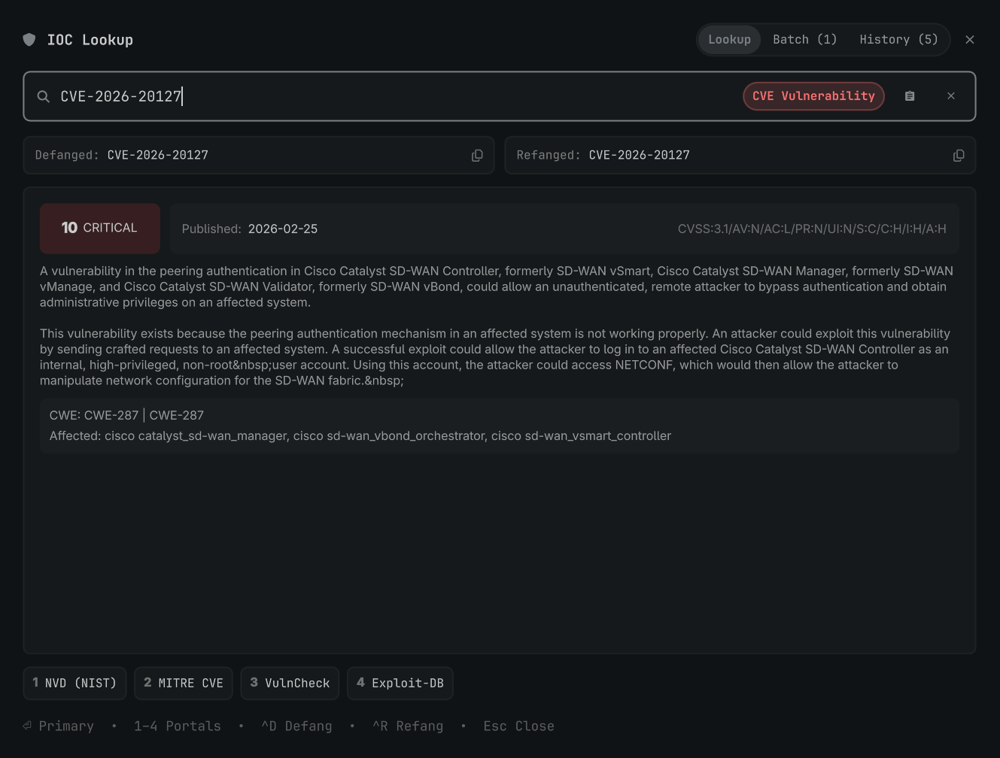

# IOCs Lookup & Threat Intelligence Suite for Omarchy

An instant, keyboard-driven Indicators of Compromise (IOC) analyzer, multi-IOC batch extractor, investigation notebook, and threat intelligence launcher for Omarchy.



---

## 🚀 Features

1. **Summonable GUI Overlay (`SUPER + ALT + I`)**:
   - **Auto-Clipboard Grab**: Automatically detects and analyzes copied IOCs on open.
   - **Defang & Refang**: One-click copying of defanged (`hxxps://evil[.]com`, `1[.]1[.]1[.]1`) or refanged formats.
   - **Live Threat Enrichment**: GeoIP, ISP, ASN, reverse DNS PTR, Cloudflare DoH (A/AAAA/MX), RDAP Registrar, NIST NVD CVE scores, and optional AbuseIPDB/VirusTotal API scores.
   - **One-Click Launchers**: Direct access to VirusTotal, AbuseIPDB, Shodan, AlienVault OTX, URLScan.io, Cisco Talos, GreyNoise, CyberChef, and NVD.

2. **🔍 Multi-IOC Batch Extractor**:
   - Copy a messy block of text, incident ticket, or raw firewall log.
   - The widget extracts and deduplicates all IPs, Domains, URLs, Hashes, and CVEs into a triage list.
   - Click any item to immediately run a full analysis, or click **Copy All Defanged** / **Copy All Refanged**.

3. ** Investigation Notebook & Markdown Export**:
   - Automatically logs all looked-up IOCs and findings to `~/.local/state/omarchy/ioc-history.json`.
   - Click **📋 Copy Markdown Report** to generate a complete markdown table ready for incident tickets (Jira, GitHub, Obsidian).

4. **💻 CLI Utility (`ioc`)**:
   - Run lookups and defanging directly from your terminal:
     ```bash
     # Single lookup with colored threat card
     ioc 1.1.1.1
     ioc evil[.]com
     ioc CVE-2021-44228

     # Defang or Refang strings / pipes
     ioc -d "https://bad.com/payload.exe"
     cat urls.txt | ioc -d

     # Extract all IOCs from logs or text
     ioc -e "alert dst=1.1.1.1 domain=evil[.]com hash=9f88ac7b05813adde353cd8e2c56adc1"

     # View history or export markdown report
     ioc --history
     ioc --export

     # Open graphical overlay
     ioc --ui
     ```

---

## ⌨️ Keybindings & Shortcuts

| Key | Action |
|---|---|
| **`SUPER + ALT + I`** | Toggle GUI Overlay |
| **`⏎ Enter`** | Open primary portal in default browser |
| **`1` – `8`** (or click) | Open specific threat intel service |
| **`Ctrl + V`** | Paste and analyze from clipboard |
| **`Ctrl + D`** | Copy Defanged version |
| **`Ctrl + R`** | Copy Refanged version |
| **`Esc`** | Close overlay |

---

## 🔑 Optional API Keys Configuration

Add API keys to `~/.config/omarchy/ioc-lookup.json` for expanded in-widget scoring:

```json
{
  "abuseipdb_api_key": "YOUR_ABUSEIPDB_API_KEY",
  "virustotal_api_key": "YOUR_VIRUSTOTAL_API_KEY",
  "shodan_api_key": "",
  "greynoise_api_key": ""
}
```
